# Serverless and API Gateways - Lab

###  Welcome to this serverless and Cloud API Gateways Lab.
In Part A - will cover trying out `actions` , `triggers` and exposing & securing actions using `API gateways`

In Part B - we will be creating a function i.e action to classify images using visual recognition service and expose, secure it by using API gateway service.

In Part C - Additional lab using API connect

## Prerequisite:

IBM Cloud Account - [IBM Cloud Registration](https://cloud.ibm.com/registration)

Quick read on -
Functions
API Gateways

# PART A - Getting started with FaaS & API Gateways

## 1. Creating API Gateways service.

Go to API Gateways service page on IBM Cloud and `Create` a service.

[API Gateway Service](https://cloud.ibm.com/catalog/services/api-gateway)

Note: This service is available in Lite plan only.


## 2. Let us create our first function on a NodeJS runtime.

-  Go to -> [IBM Cloud Functions](https://cloud.ibm.com/functions/) and Click on `actions`

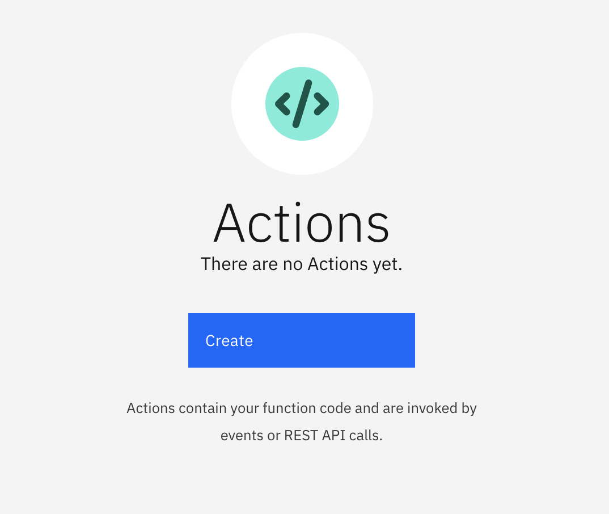

-  lets create our first action as below and click on `Create`

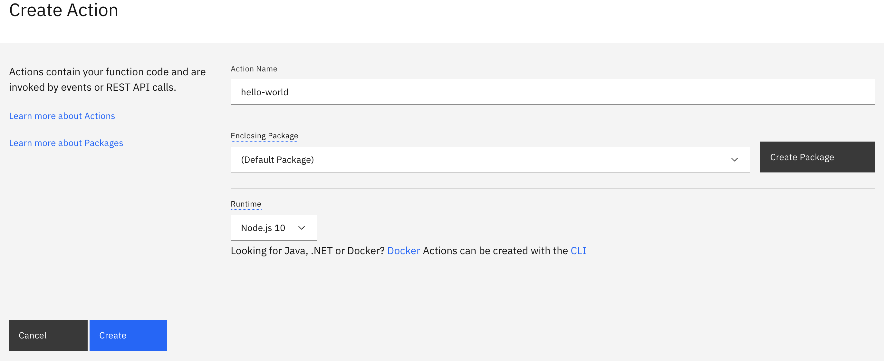

-  Lets try out if the action is working now,

Go to `Endpoints` on the left bar and copy the CURL command at bottom


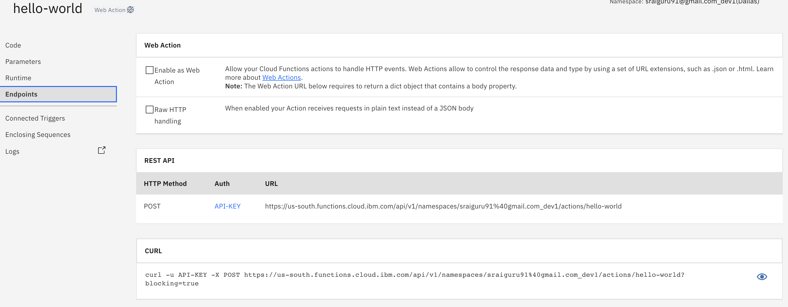


and paste in the terminal or prompt.
Alternatively you can also try web-action to check it. You will see `hello world` message in the JSON response.

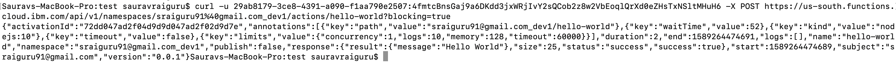


## 3 Enabling actions as a `trigger` [Optional]
Click on `connected triggers` on the left bar and select `Add Trigger` to quickly create an event based trigger.

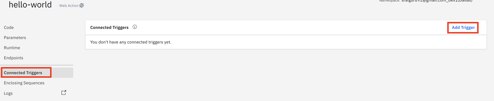

There are many ways to trigger based on an event type, but we will choose a time-based `periodic` trigger

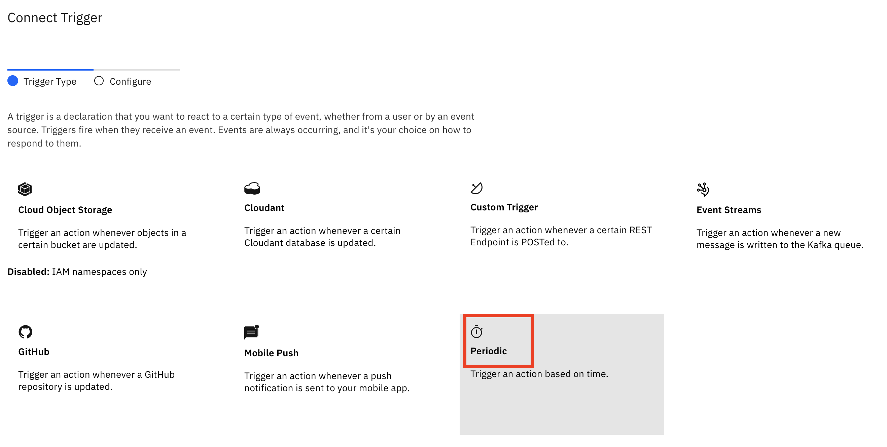
a. Provide a `trigger name` say `sample` a cron for every minute and click on `Create & Connect`

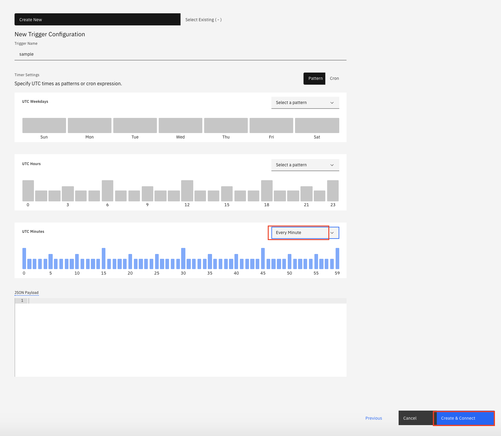

Once create this trigger will be invoked every minute (as per the rule) and we can see the same in Function Dashboard
[Functions Dashboard](https://cloud.ibm.com/functions/dashboard)


## 4. Exposing this function as a secure API & manage it using API Gateways
We need to now expose our actions as API and also secure them
-> lets go to API gateways service which we have created already earlier.
[API Management Service](https://cloud.ibm.com/functions/apimanagement)

Click on `Create API`

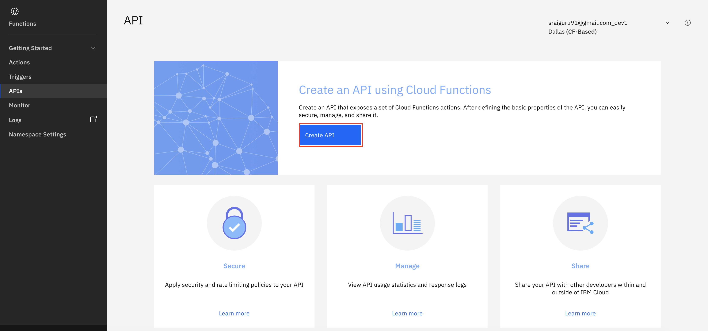

Enter `API Name` say, `sample` and Click on `Create Operation`

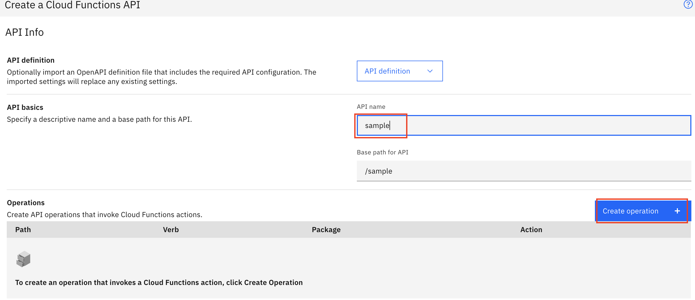

Provide a `Path` say `hello`, select the action `hello-world` you created earlier and Click on `Create`  

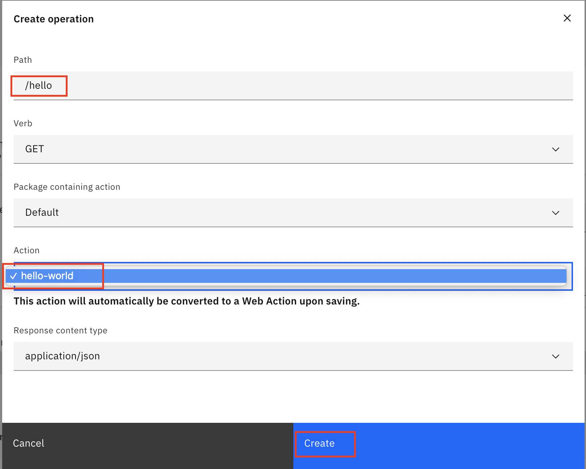

#### Securing the API Endpoint
Once we have now created an API GET /hello we need to now secure it.

- Toggle the `Require authentication via API Key`


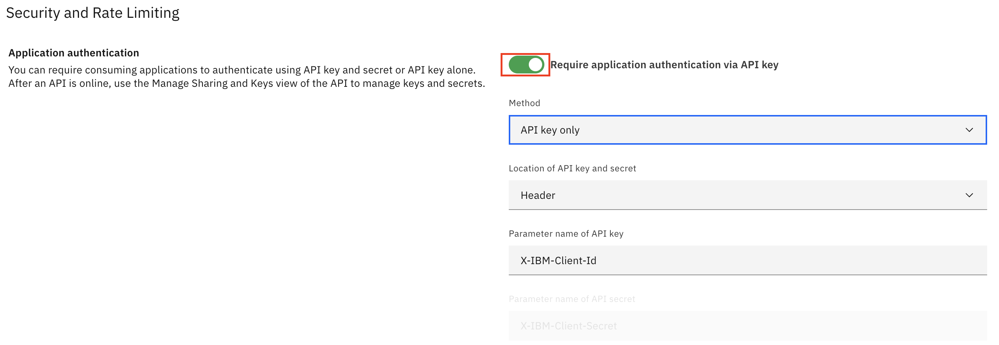
- Scroll down and click on `Save`. It will take you to `Summary` page of the API.
Wherein, we can see the API link, status etc.
- Go to `Sharing & Keys` on the left and Click on `Create API Key`

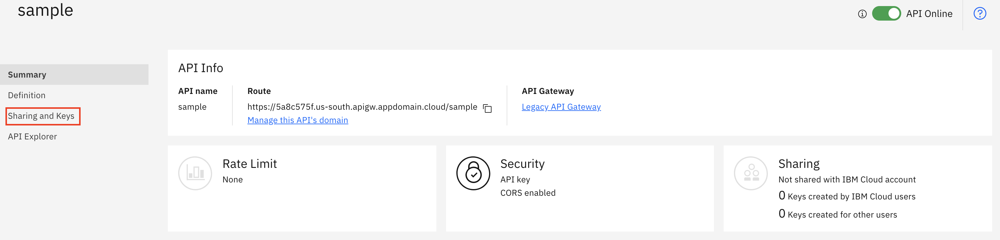

- Paste this label `X-IBM-Client-Id` and `Create` a Key
Note: Keep a note of the `generated` Client ID Key.


Now lets try using the get /Hello API with the apikey
- Go to `API Explorer` and click on `GET /hello` and `Try it`
This is the swagger which is provided for testing your API.

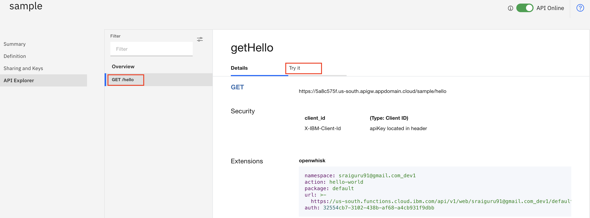

- Paste the `X-IBM-Client-Id` Key value which was noted earlier and click on `Send`.

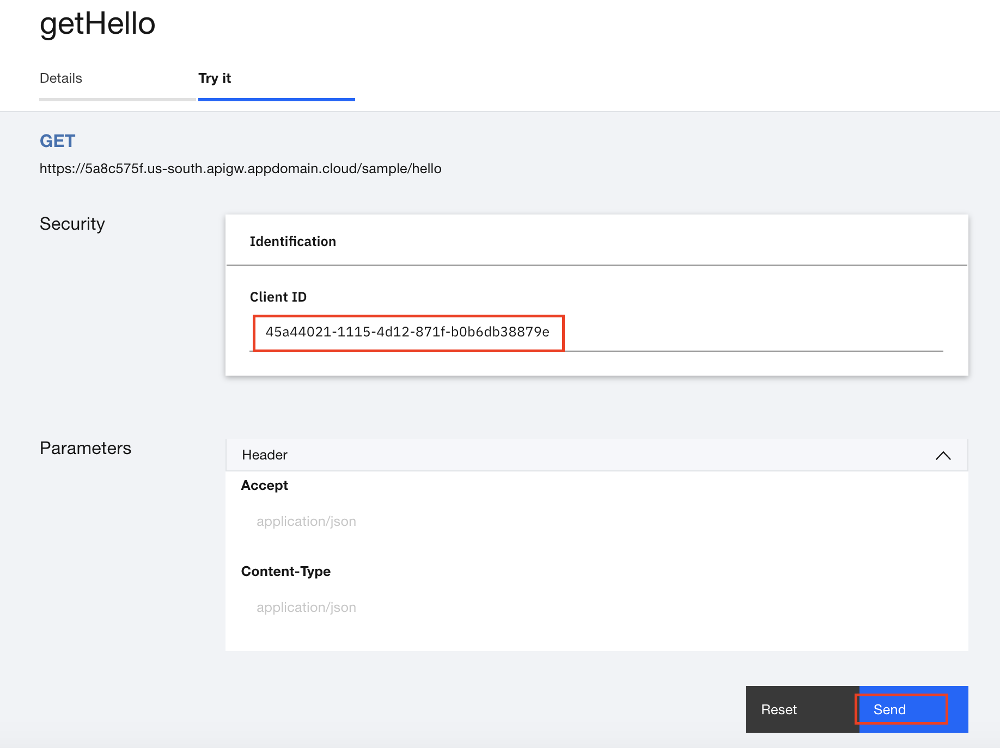

- You should see a sample response below.

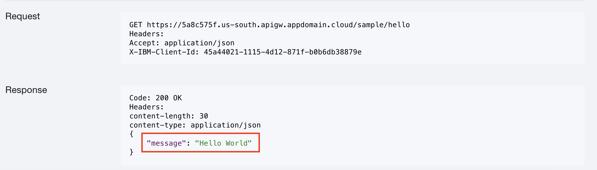


## 5. [Practice] with variables / parameters

- [Prerequisite] Create a new action hello world action on NodeJS


- Change the function `message` to parse the input parameters

```console
function main(msg) {
	return { message: "Hello, you are " + msg.name + " from " + msg.place + " and you have received " + msg.material + " as your relief materials" };
}

```

- Change the parameters accordingly in the `Invoke with parameters` and `Invoke` the function

```console
{
    "name":"Saurav",
    "place":"Bangalore",
    "material":"Biscuits"
}
```
# PART B - Image classification using Functions

## 1. Classifying images from a function using Watson Visual Recognition
1. Create a new python hello world runtime say, with a name `classify` and replace the code with below

```console

from watson_developer_cloud import VisualRecognitionV3

def main(params):
    # init visual recognition library
    apiKey = params['apiKey']
    version = "2018-03-19"
    visual_recognition = VisualRecognitionV3(version=version, iam_apikey=apiKey)

    # get image url from params
    image_url = params['imageUrl']

    # parse visual recognition return data for our tags
    tags = ""
    classifiedImages = visual_recognition.classify(url=image_url).get_result()
    image = classifiedImages['images'][0]
    classes = image['classifiers'][0]['classes']
    for theClass in classes:
        currentTag = theClass['class']
        print(currentTag)
        tags = tags + currentTag + ", "
    result = {'classes': tags}
    return result
```

2.  Create a Visual Recognition service from here - [Visual Recognition Service](https://cloud.ibm.com/catalog/services/visual-recognition)

Once created you can go to `service credentials` section and make a note of the `apiKey`, which will be used to call the VR service.


3. This action expects the `apiKey` to be passed in as a parameter, and lets do it.


`Default parameters` can be set for an action, rather than passing the parameters into the action every time.
This is a useful option for data that stays the same on every invocation. Let’s set the apiKey as one of our default parameters.

Click `Parameters` in the left side menu, and then click `Add Parameter +`
For parameter name, `apiKey`, with a capital K. For parameter value, insert your apiKey value enclosed in quotation marks. Click `Save`.

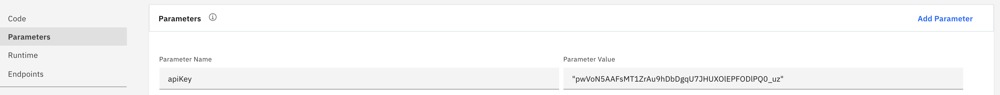


P.S the `apiKey` value can be obtained from Visual Recognition service.

Note: Just for this test run add another parameter in the `Invoke with Parameters` and insert the below JSON parameter.

```console
{
    "imageUrl":"https://raw.githubusercontent.com/beemarie/ow-vr/master/images/puppy.jpg"    
}
```
You should see an output as below
```console
{
  "classes": "puppy, dog, domestic animal, animal, Labrador retriever dog, retriever dog, golden retriever dog, pale yellow color, light brown color, "
}
```

4. Now lets go to our [API Management Service](https://cloud.ibm.com/functions/apimanagement) and create an API & its gateway to access our image classification function.

Click on `Create API`

- Enter `API Name` say, `classify` and Click on `Create Operation`.

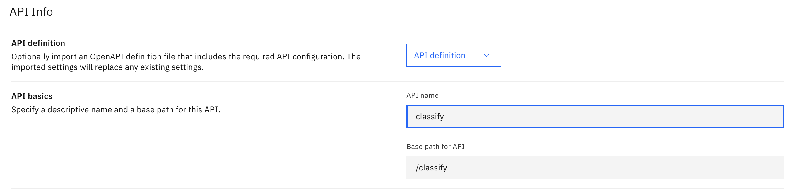

- Provide a `Path` say `post-classify`,
select the action `Classify`-> `POST` you created earlier and Click on `Create`

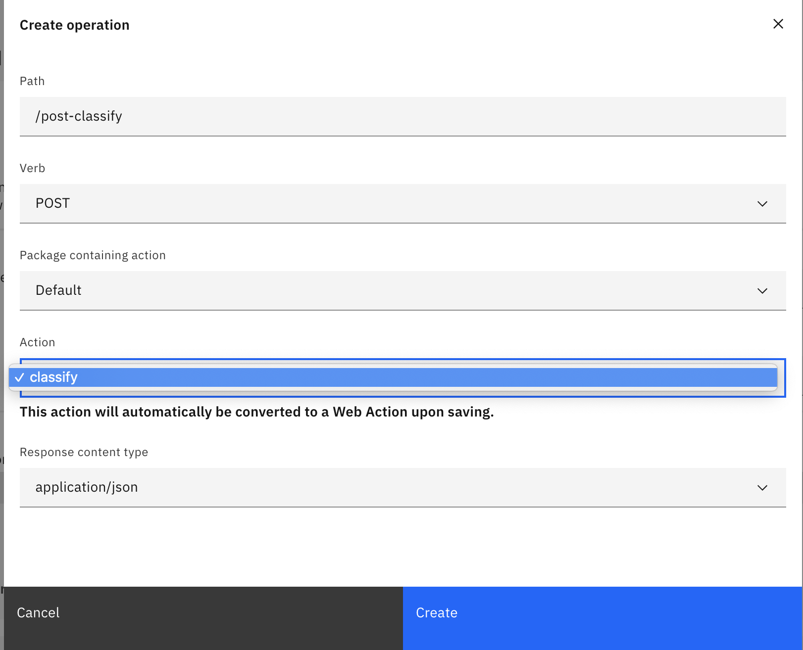

####   Securing the API Endpoint
Once we have now created an API GET /hello we need to now secure it.

- Toggle the `Require authentication via API Key`


- Scroll down and click on `Save`. It will take you to `Summary` page of the API.
Wherein, we can see the API link, status etc.

- Go to `Sharing & Keys` on the left and Click on `Create API Key`


- Paste this label `X-IBM-Client-Id` and `Create` a Key

Note: Keep a note of the `generated` Client ID Key.


Now lets try using the `POST /classify` API with the Client ID Key

- Go to `API Explorer` and click on `POST /classify` and `Try it`

Note: This is the swagger which is provided for testing your API.

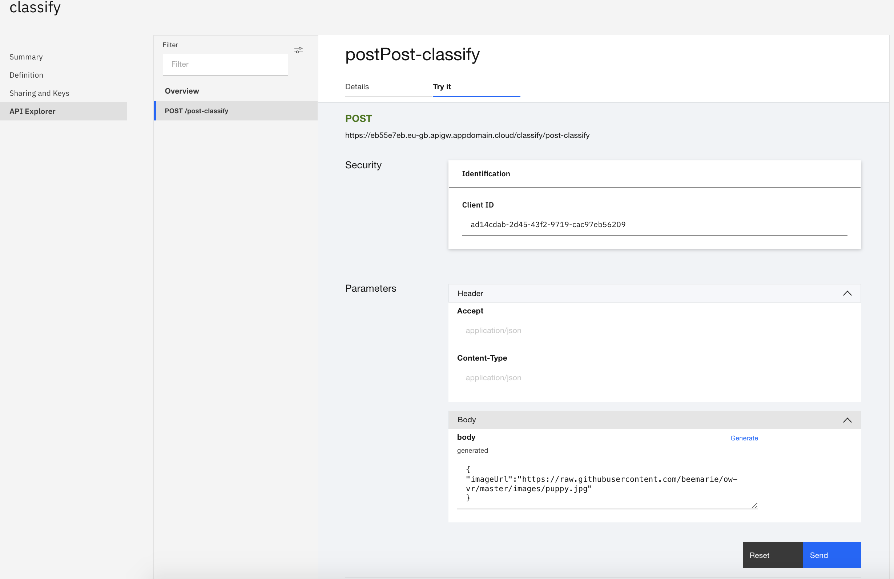

- Paste the `X-IBM-Client-Id` Key value which was noted earlier
- Also, paste imageUrl in the body parameter
```console
{
    "imageUrl":"https://raw.githubusercontent.com/beemarie/ow-vr/master/images/puppy.jpg"    
}
```
- Click on `Send`.

- You should see a sample response having the image classification below.

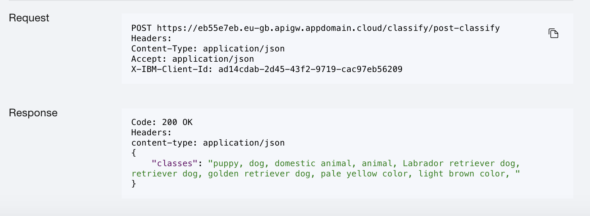


# PART C - Additional lab using API connect

### Managing your APIs throughout the API lifecycle

[create & manage APIs using API Connect](https://developer.ibm.com/tutorials/create-and-manage-apis-using-api-connect/)
